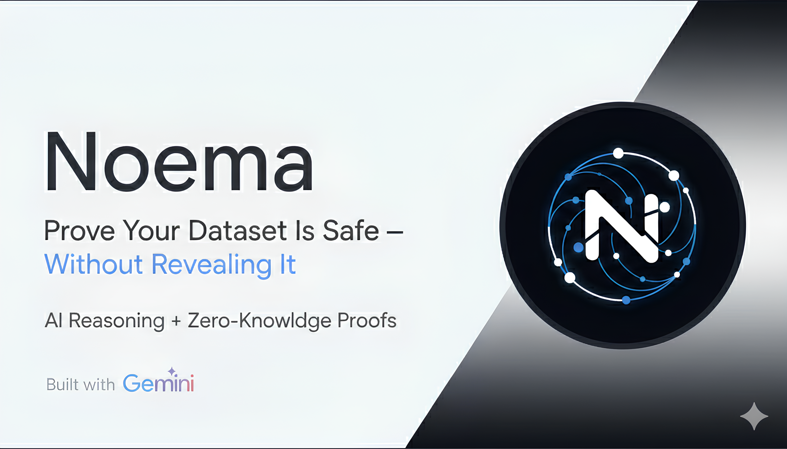

# Noema

<p align="center">
  
</p>

**Verifiable dataset compliance using Gemini reasoning and zero-knowledge proofs.**

Noema is a proof-of-concept system that enables organizations to evaluate private datasets against governance policies (privacy, safety, regulatory constraints) and generate a **publicly verifiable proof that the policy decision was computed correctly from declared evaluation outputs**, without revealing the underlying dataset.

📸 Demo Video  
https://www.youtube.com/watch?v=VvV0VkkP7tY

---

## Overview

Organizations often need to demonstrate dataset compliance without exposing proprietary or sensitive data. Noema explores a privacy-preserving approach that combines AI-assisted dataset evaluation with zero-knowledge proofs, enabling verification of compliance decisions without requiring dataset disclosure.

---

## How it works

1. A dataset owner uploads a dataset and selects governance constraints.
2. Gemini evaluates the dataset and produces structured severity assessments for each constraint.
3. Policy aggregation computes the final policy decision (PASS / FAIL).
4. A gnark zero-knowledge circuit generates a proof verifying that the policy decision was computed correctly from the declared policy configuration and evaluation outputs.
5. Anyone can verify the proof without accessing the dataset.

**Important:**  
The system proves that the policy decision was computed correctly from the declared evaluation outputs. It does **not** prove that the AI evaluation itself is correct.

---

## Features

- ZK compliance proofs for policy decision verification
- Gemini-assisted structured dataset evaluation
- gnark Groth16 policy gate circuit
- Golang backend orchestration pipeline
- Web dashboard for dataset evaluation and proof verification

---

## Tech stack

| Layer         | Technology      |
|---------------|-----------------|
| AI evaluation |   Gemini API    |
| ZK proofs     | gnark (Groth16) |
| Backend       |    Go (Gin)     |
| Frontend      | Server-rendered web interface|
---

## Setup & Run

Requirements:
- Go 1.21+
- `.env` file containing required configuration (`JUDGE_KEY`, `GEMINI_API_KEY`)

```bash
git clone https://github.com/YaniXIV/noema.git
cd noema/backend

# create a .env file in Noema/backend and set required variables 
go build cmd/server/main.go
./main
```

## 🙏 Acknowledgments

```bash
Google Gemini & Google Deepmind teams

The Google Gemini 3 Hackathon for the challenge and motivation

Everyone exploring real-world privacy applications in ZK and AI applications
```
